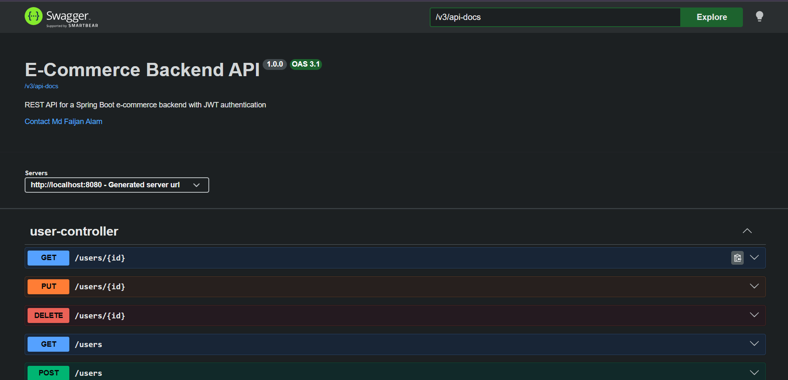
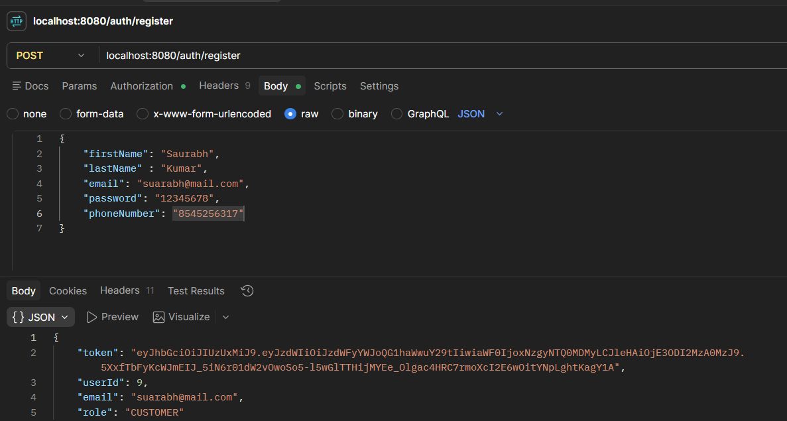
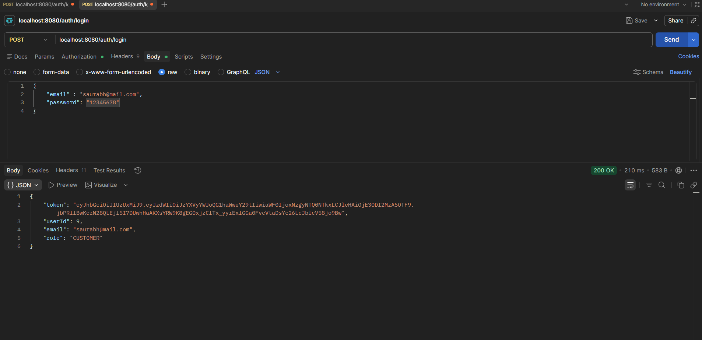
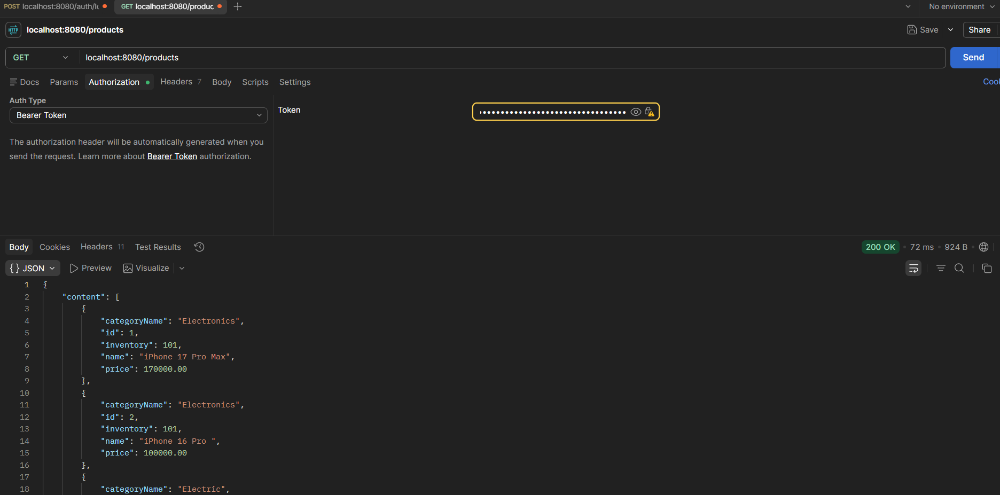

# E-Commerce Backend

A production-style e-commerce REST API built with Spring Boot, featuring JWT-based authentication, role-based authorization, and a complete shopping flow from product catalog to order placement.

## Features

- **User Authentication** — Register/login with JWT tokens, BCrypt password hashing
- **Role-Based Access Control** — `CUSTOMER` and `ADMIN` roles with route-level and ownership-level authorization
- **Category & Product Management** — Full CRUD with pagination and sorting
- **Shopping Cart** — Add/update/remove items, quantity merging, automatic cart creation
- **Order Management** — Cart-to-order checkout, price/name snapshotting at purchase time, order status lifecycle (`PLACED` → `SHIPPED` → `DELIVERED` / `CANCELED`)
- **Global Exception Handling** — Consistent JSON error responses across the API
- **DTO-based architecture** — Clean separation between entities and API contracts

## Tech Stack

| Layer | Technology |
|---|---|
| Language | Java 21 |
| Framework | Spring Boot 4.1.0 |
| Security | Spring Security + JWT (jjwt) |
| Persistence | Spring Data JPA / Hibernate |
| Database | MySQL |
| Build Tool | Maven |
| Utilities | Lombok |

## Architecture

The project follows a layered architecture, consistent across every module:

```
Controller   → handles HTTP requests, delegates to service
Service      → business logic, validation, authorization checks
Repository   → Spring Data JPA interfaces
Entity       → JPA-mapped database models
DTO          → request/response contracts (never expose entities directly)
```

### Key design decisions

- **Cart vs. Order** — Cart is mutable working state (prices read live from `Product`); Order is an immutable historical record (`OrderItem` snapshots `productName` and `price` at checkout time, so past orders never change even if product data changes later).
- **Ownership checks everywhere** — Endpoints that operate on a specific resource (cart item, order, user profile) verify the resource belongs to the authenticated caller, preventing one user from accessing or modifying another user's data (IDOR protection).
- **Role assignment is never client-controlled** — `role` is never read from self-service request bodies (registration, profile updates); it's always set server-side, preventing privilege escalation.

## Project Structure

```
src/main/java/com/faijan/ecommerce/
├── controller/      # REST controllers
├── service/         # Service interfaces
│   └── serviceImp/  # Service implementations
├── repository/       # Spring Data JPA repositories
├── entity/           # JPA entities
├── dto/
│   ├── request/      # Incoming request DTOs
│   └── response/      # Outgoing response DTOs
├── security/          # JWT utilities, filters, Spring Security config
└── exception/         # Custom exceptions + global exception handler
```

## Modules

| Module | Description |
|---|---|
| Auth | Register, login, JWT issuance |
| User | Profile management (self-service + admin) |
| Category | Product categorization, CRUD |
| Product | Product catalog, CRUD, linked to Category |
| Cart | Per-user cart, add/update/remove items |
| Order | Checkout, order history, status updates |

## API Overview

### Auth
| Method | Endpoint | Access |
|---|---|---|
| POST | `/auth/register` | Public |
| POST | `/auth/login` | Public |

### Categories
| Method | Endpoint | Access |
|---|---|---|
| GET | `/categories` | Public |
| GET | `/categories/{id}` | Public |
| POST | `/categories` | Authenticated |
| PUT | `/categories/{id}` | Authenticated |
| DELETE | `/categories/{id}` | Authenticated |

### Products
| Method | Endpoint | Access |
|---|---|---|
| GET | `/products` | Public |
| GET | `/products/{id}` | Public |
| POST | `/products` | Authenticated |
| PUT | `/products/{id}` | Authenticated |
| DELETE | `/products/{id}` | Authenticated |

### Cart
| Method | Endpoint | Access |
|---|---|---|
| GET | `/carts` | Authenticated (own cart) |
| POST | `/carts/items` | Authenticated |
| PUT | `/carts/items/{cartItemId}` | Authenticated (own item) |
| DELETE | `/carts/items/{cartItemId}` | Authenticated (own item) |
| DELETE | `/carts` | Authenticated (own cart) |

### Orders
| Method | Endpoint | Access |
|---|---|---|
| POST | `/orders` | Authenticated |
| GET | `/orders/{orderId}` | Authenticated (own order) |
| GET | `/orders/my-orders` | Authenticated |
| GET | `/orders` | Admin |
| PUT | `/orders/{orderId}/status` | Admin |
| DELETE | `/orders/{orderId}` | Authenticated (own order, cancel) |

### Users
| Method | Endpoint | Access |
|---|---|---|
| GET | `/users/{id}` | Self or Admin |
| PUT | `/users/{id}` | Self or Admin |
| DELETE | `/users/{id}` | Self or Admin |
| GET | `/users` | Admin |

## API Documentation (Swagger)

Interactive API documentation is available via Swagger UI once the application is running:

```
http://localhost:8080/swagger-ui.html
```

Raw OpenAPI spec:

```
http://localhost:8080/v3/api-docs
```


## Screenshots

| Swagger UI Overview |
|---|
|  |

| Registration Overview |
|---|
|  |

| Login Overview |
|---|
|  |

| Product |
|---|
|  |


## Getting Started

### Prerequisites

- Java 21+
- Maven
- MySQL 8.x

### 1. Clone the repository

```bash
git clone https://github.com/<your-username>/ecommerce-backend.git
cd ecommerce-backend
```

### 2. Create the database

```sql
CREATE DATABASE ecommerce_db;
```

### 3. Configure `application.properties`

Create `src/main/resources/application.properties` (this file is git-ignored — see below) with:

```properties
spring.datasource.url=jdbc:mysql://localhost:3306/ecommerce_db
spring.datasource.username=your_mysql_username
spring.datasource.password=your_mysql_password

spring.jpa.hibernate.ddl-auto=update
spring.jpa.show-sql=true

jwt.secret=<your-base64-encoded-secret>
jwt.expiration=86400000
```

> **Generating a JWT secret:** Use any cryptographically random Base64 string, e.g.:
> ```bash
> openssl rand -base64 64
> ```

### 4. Build and run

```bash
mvn clean install
mvn spring-boot:run
```

The API will be available at `http://localhost:8080`.

### 5. Create the first admin account

Since registration always assigns the `CUSTOMER` role, the first `ADMIN` account must be created manually:

```sql
INSERT INTO users (first_name, last_name, email, password, role, created_at, updated_at)
VALUES ('Admin', 'User', 'admin@example.com', '<bcrypt-hash>', 'ADMIN', NOW(), NOW());
```

Generate a BCrypt hash for your chosen password using any BCrypt utility (online generator, or a small Java snippet using `BCryptPasswordEncoder`).

## Testing the API

1. `POST /auth/register` — create a customer account, receive a JWT token
2. Use the token in subsequent requests: `Authorization: Bearer <token>`
3. Browse products/categories (no auth required)
4. Add items to cart, place an order
5. Log in as the manually-created admin to test admin-only endpoints (`/orders`, `updateOrderStatus`)

## Security Notes

- Passwords are hashed with BCrypt before storage — never stored in plain text.
- JWT tokens are stateless; no server-side session is maintained.
- `jwt.secret` should never be committed to version control in a real deployment — use environment variables or a secrets manager. For this learning project, it's kept in a git-ignored `application.properties`.

## License

This project was built for educational and placement-preparation purposes.
